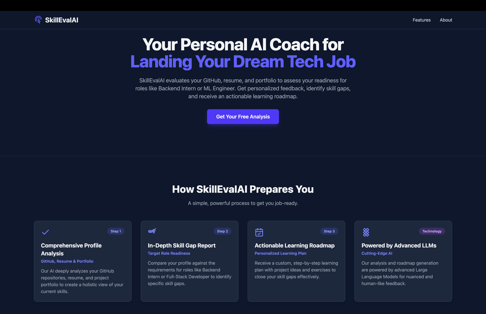
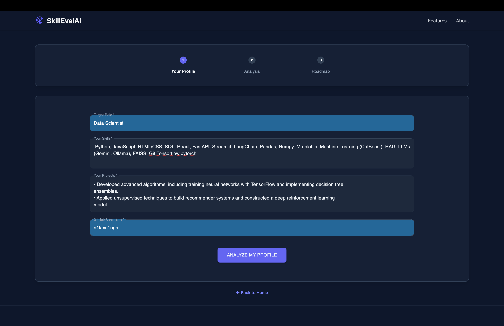
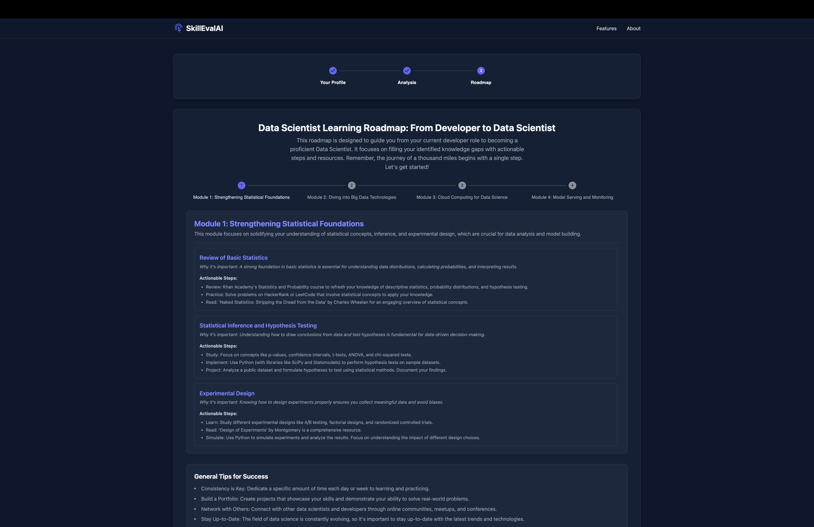

# SkillEvalAI 🧠💼  
**An AI-powered assistant that evaluates your tech career readiness and builds a 30-day personalized learning roadmap.**

[](https://skilleval.ai)
[](https://www.langchain.com/)
[](LICENSE)

---

## 📌 Description

**SkillEvalAI** is a smart assistant that helps tech students and aspiring developers evaluate their job readiness for roles like **Backend Intern**, **Machine Learning Engineer**, and **Full-Stack Developer**. It uses your GitHub profile, Skills , and Project details to:

- Give you a **Readiness Score**
- Offer **detailed feedback** on your current skills and project quality
- Recommend improvements and identify **skill gaps**
- Generate a **30-day personalized learning roadmap**

Built using FastAPI + LangChain on the backend and React + Tailwind CSS on the frontend, SkillCoachAI makes career planning smarter, faster, and AI-driven.


---
## 🌐 Live Demo

🚀 Try SkillEvalAI live and see your tech readiness in action!

👉 **[SkillEvalAI](https://skill-eval-ai-yozc.vercel.app/)** 

🔍 Get your **readiness score**, 🧠 uncover **skill gaps**, and 📅 generate a **30-day roadmap** — all in seconds.

---

## ✨ Features

- 🔍 **Advanced Summarization** of your profile aligned with a chosen job role
- 📊 **Readiness Score** with personalized skill gap analysis
- 📁 **Project Portfolio Review** with detailed feedback
- 📅 **30-Day AI-Generated Learning Roadmap**
- 🌐 Modern UI with instant feedback, powered by LLMs

---

## 📸 Visuals


*SkillCoachAI home page - clean input form and powerful feedback engine*


*Simple form to input your GitHub profile, resume, and project details before starting the evaluation*


*Detailed readiness score and personalized skill gap analysis generated from your GitHub and resume*


*Tailored learning roadmap generated based on GitHub and resume analysis*


---

## 🧰 Tech Stack

### Frontend
- React
- Tailwind CSS
- Vite
- Deployed via [Vercel](https://vercel.com/)

### Backend
- FastAPI
- LangChain
- OpenAI / Gemini LLMs
- GitHub API
- Deployed on [Vercel](https://vercel.com/)

---

## ⚙️ Installation

### Requirements

- Python 3.9+
- Node.js 18+
- `pip`, `npm` or `yarn`

---

### 1. Clone the Repository

```bash
git clone https://github.com/n1lays1ngh/SkillEval.ai.git
cd SkillEval.ai
```

---

### 2. Backend Setup

```bash
cd backend
pip install -r requirements.txt
```

**.env (Backend):**

```
OPENAI_API_KEY=your_openai_api_key
GITHUB_API_KEY=your_github_api_key
```

---

### 3. Frontend Setup

```bash
cd ../frontend
npm install
# or
yarn install
```

**.env (Frontend):**

```
VITE_BACKEND_URL=http://localhost:8000
```

---

## 🚀 Usage

### 1. Start Backend

```bash
cd backend
uvicorn main:app --reload
```

### 2. Start Frontend

```bash
cd ../frontend
npm run dev
# or
yarn dev
```

Visit: [http://localhost:5173](http://localhost:5173)

---

## 🧭 Example Flow

1. Enter your GitHub username,Skills and Project Summary
2. Select a job role (e.g., Backend Intern)
3. Click "Analyze" → Get a readiness score + detailed feedback
4. Click "Generate Roadmap" → Receive a 30-day custom learning plan

---

## 🙋 Support

Need help or have suggestions?

- Open an [Issue](https://github.com/n1lays1ngh/SkillEval.ai/issues)
- Email: `nilay31singh@gmail.com`
- Connect via [LinkedIn](https://www.linkedin.com/in/nilay-singh-796808276/)

---

## 🤝 Contributing

We welcome contributions! Here's how to get started:

1. Fork the project
2. Create your feature branch  
   `git checkout -b feature/AmazingFeature`
3. Commit your changes  
   `git commit -m 'Add AmazingFeature'`
4. Push to the branch  
   `git push origin feature/AmazingFeature`
5. Open a Pull Request

Make sure to write tests and update the docs as needed.

---

## 👨‍💻 Author

**Nilay Singh**  
🔗 [LinkedIn](https://www.linkedin.com/in/nilay-singh-796808276/)  

---

## 📄 License

This project is licensed under the [MIT License](LICENSE).

---

## 🚦 Project Status

🚀 Actively maintained and under active development.  
Expect frequent improvements and feature additions!

---